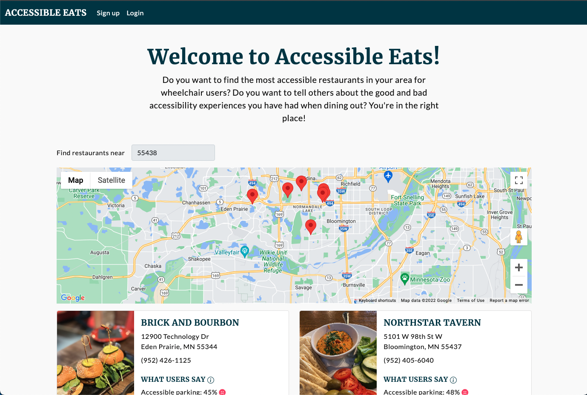
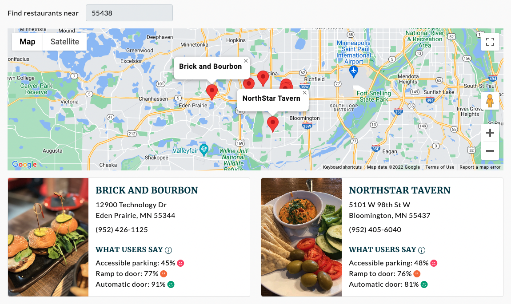
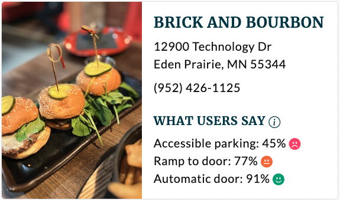
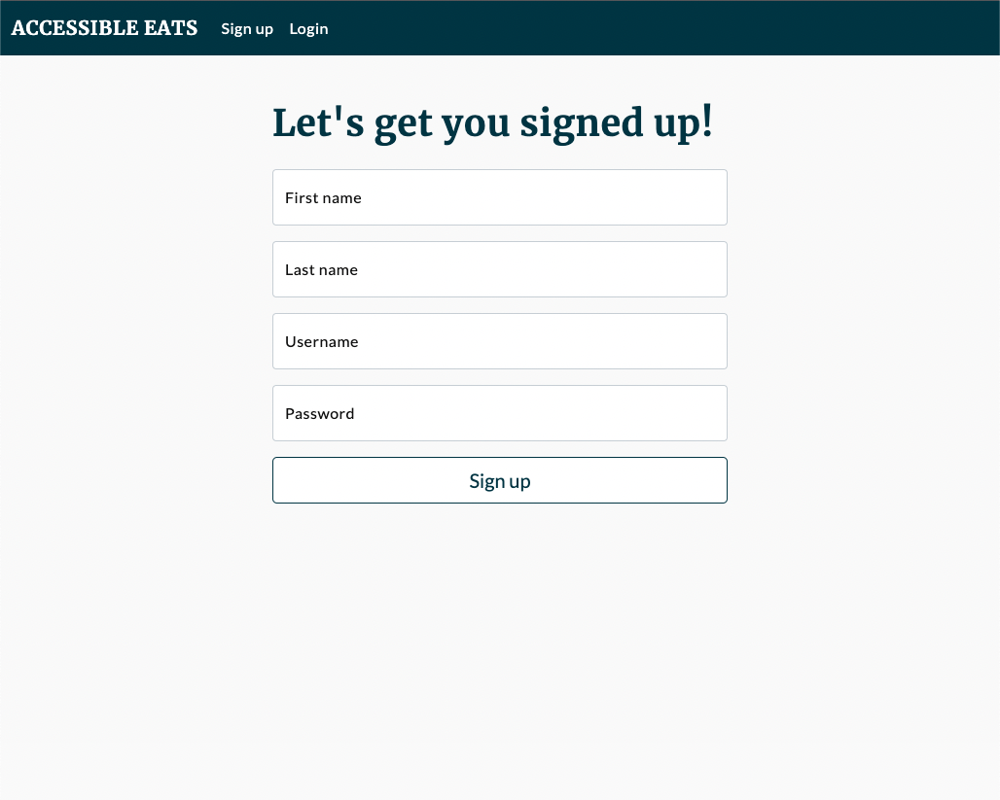
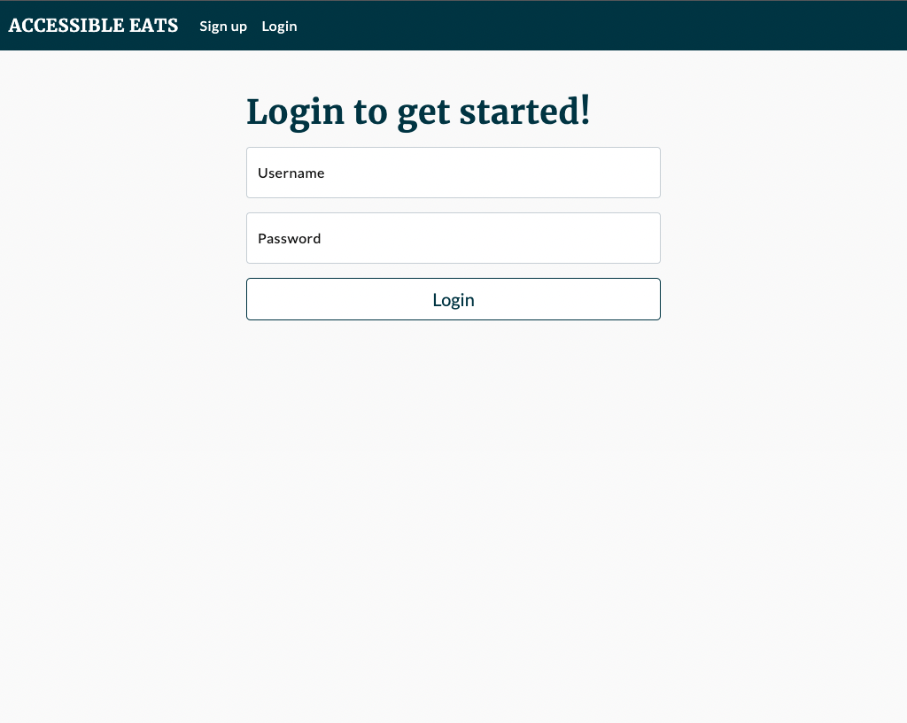
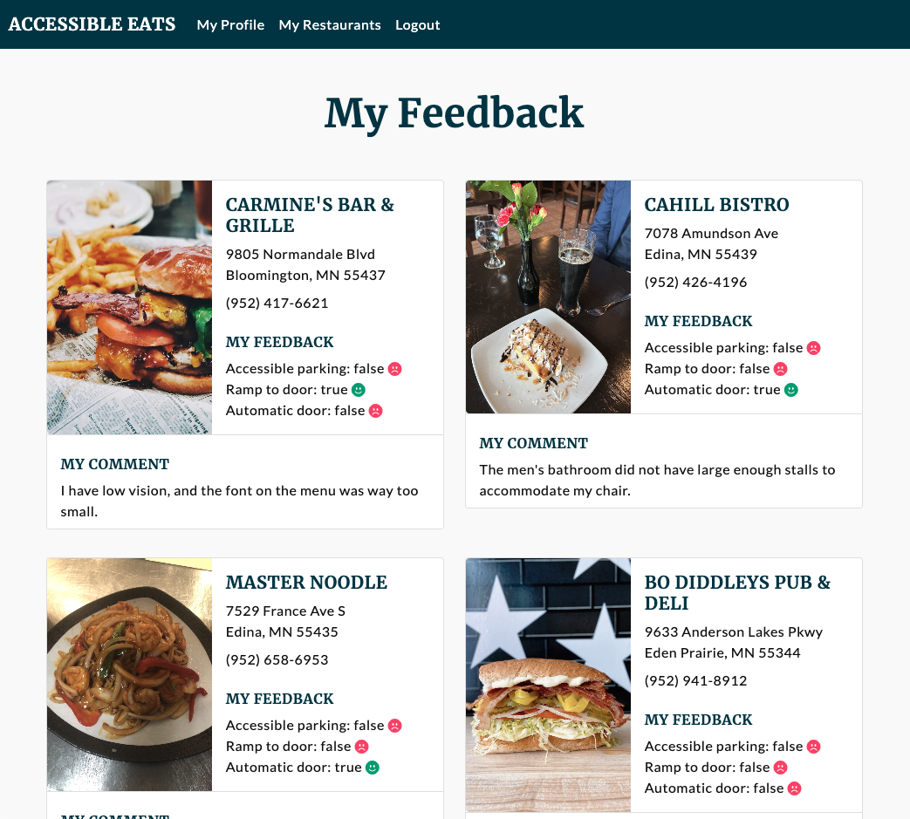
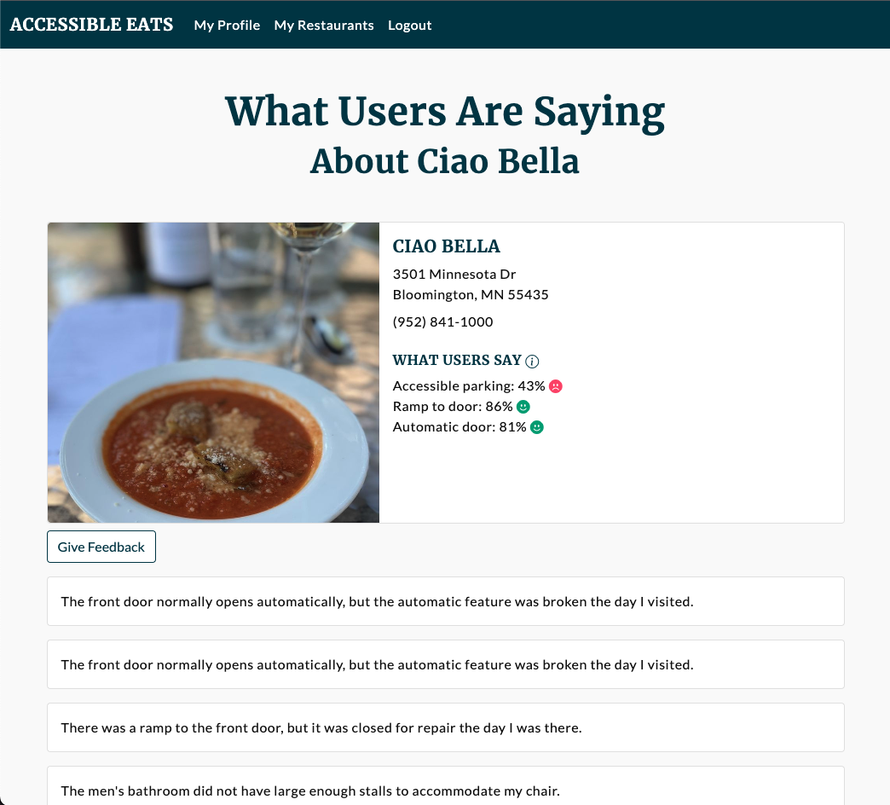
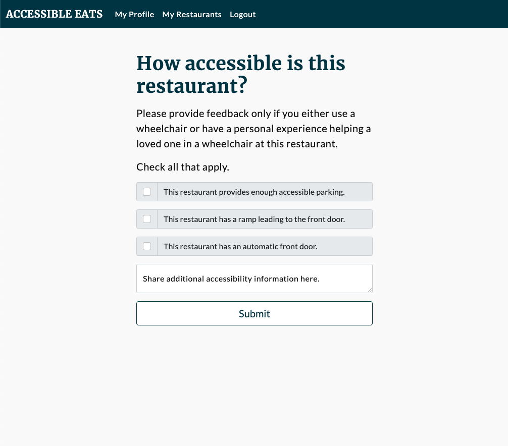

# Accessible Eats
Accessible Eats is deployed at http://3.133.160.108/

## About the author
Learn more about the developer: [Andrea Martz](https://www.linkedin.com/in/andreamartz/)

## Important note about the data
This project was built as a proof of concept with fake data over a six-week 
period as my capstone project for Hackbright Academy. Because the data is fake, 
no conclusions of any kind should be drawn about the accessibility of the 
businesses represented in the screenshots below or any other businesses searched 
using the app.

For best results, search the 55438 zip code or nearby zip codes. Restaurants in 
zip codes outside of that general area are not represented in the database.

## Reason for the Project
The physical world has mostly been built for people without disabilities. For 
people in wheelchairs, this creates problems on a daily basis. For example, if 
the front door of a building does not open automatically, a person in a 
wheelchair will have a very difficult time entering.

At the time this project was built, social media platforms like Yelp tended not
to provide more than the most general accessibility information, such as 
"Wheelchair accessible." What does wheelchair accessible really mean? 
There are many features of a restaurant that can be accessible or inaccessible. 
One overall rating is not sufficient.
 
## Project Description
Accessible Eats is a fully responsive single-page app which aims to empower wheelchair users and their loved ones by crowd-sourcing accessibility information about multiple features of a restaurant and making it public. Users can:

* let others know how accessible (or inaccessible) a business or public 
place is by providing feedback.
* learn from the experiences of others when choosing a restaurant in an 
unfamiliar town. This helps them avoid restaurants that are not making enough 
of an effort to be accessible. 

## User Flow with Screenshots
### Homepage
The app opens on the homepage, which displays a Google Map with markers for 
restaurants in a default zip code (55438). 

The markers are clickable; when clicked, each will open an info window about 
that restaurant.

### Info Cards
Below the map are informational cards for the restaurants on the map. Similar 
cards appear on multiple pages. All cards are rendered from a single React 
component. The cards summarize the accessibility information provided for the 
restaurants by users. Here is a close-up look at one of the cards:

#### What Users Say Section
The percentages on the cards are the aggregated percentages of users who gave 
feedback indicating that the restaurant had each of the accessibility features. 
See Feedback section below for more information.

The emoji displayed for each feature is based on the percentage as follows:
* below 50%: red frowning emoji
* 50 to 80%: orange neutral emoji
* above 80%: green smiling emoji

## Sign up Page

## Login Page

## My Restaurants Page
The My Restaurants page is where a user can go to see their previous ratings of 
and comments about restaurants.

## Business Details Page

## Feedback Page
From the Business Details Page, a user can click on the Give Feedback button,  
which takes them to a form where they can give feedback about a restaurant by leaving a comment or checking the boxes of the statements they agree with:

## Technologies Used

### Main Tech Stack

This is a single-page app built primarily with:

* Python
* Flask
* PostgreSQL
* JavaScript
* React.js

### Other Libraries and Frameworks
* SQLAlchemy
* Faker - used to generate much of the fake data
* Jinja - Jinja was used to return a single HTML page to the frontend
* Bootstrap

### APIs
* Google Maps API (mapping and geocoding services)
* Yelp Fusion API

## How to install and run the project locally

### Get an API key from Google Maps API

This app makes calls to the Google Maps API and uses the mapping and geocoding 
services. For a fully functional app, you will need to get your own key from
the API by going to 
[Create API keys](https://developers.google.com/maps/documentation/embed/get-api-key#create-api-keys)
and following the instructions there.

### Get an API key from Yelp Fusion API

This app makes calls to the Yelp Fusion API to get restaurant data. For a fully 
functional app, you will need to get your own key from the API by going to 
[Authentication on Yelp Fusion API](https://docs.developer.yelp.com/docs/fusion-authentication)
and following the instructions.

### Project setup and installation from command line

1. If you don't have these programs on your machine already, you should install:
    * Python 3.10, 
    * PostgreSQL

2. Clone this git repo to your local machine.

3. Create a virtual environment in the repo:
    `virtualenv env`

4. Source the virtual environment:
    `source env/bin/activate`

5. Create a file called `secrets.sh` at the top level of the repo.
    This file should contain the api keys for the Google Maps API and the 
    Yelp Fusion API. Put the following into the file, substituting the actual 
    API keys where indicated:
    export MAPS_JS_API_KEY=<insert Google Maps API key here>
    export YELP_FUSION_API_KEY=<insert Yelp Fusion API key here>

6. At the command line, source the secrets.sh file as follows:
    `source secrets.sh`

7. To install the requirements from the requirements.txt file
    `pip3 install -r requirements.txt`

8. If you want to seed the database,
    `python3 seed_database.py`

9. To start the server:
    `python3 server.py`

10. Navigate to localhost:5000 in your browser to see the project.

Some functionality is available only to logged in users. To access these 
features, you can either create an account or log in as one of the fake users.

## References
- [Accessibility for Yelp](https://www.tanya-moss.com/yelp)
- [Yelp for Everyone](https://www.sarahpaul.us/case-study-yelp)